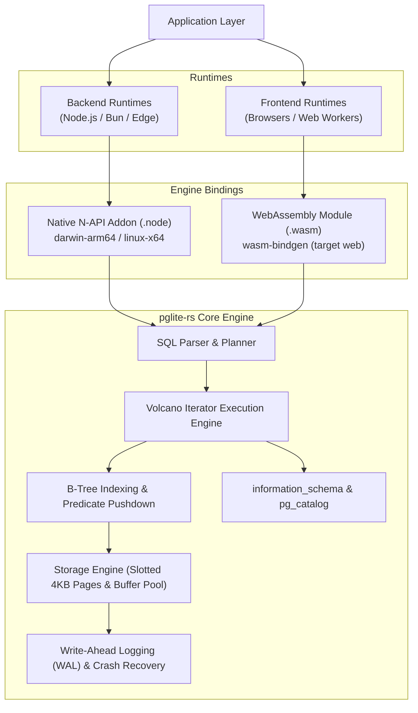

# PostgresLite (PGlite) 🚀

[]()

**High-Performance, In-Process Embedded PostgreSQL Database Engine Powered by Rust & WebAssembly.**  
*Native C-speed for Node.js/Bun via N-API and near-native speed for the Web via WebAssembly (WASM).*

[](https://bun.sh)
[](https://nodejs.org/)
[](https://www.rust-lang.org/)
[](https://webassembly.org/)
[](https://www.typescriptlang.org/)
[](tests/)
[](LICENSE)

---

## 🌟 Overview

**PostgresLite** (`@pglite/core`) is a lightweight, zero-dependency, serverless embedded PostgreSQL engine designed as an ultra-fast **SQLite alternative** with authentic **PostgreSQL syntax and semantics**.

Traditional PostgreSQL setups require a separate background daemon, network TCP overhead, connection pools, and containerized infrastructure. **PostgresLite runs entirely in-process**:
- **Backend Runtimes (Node.js & Bun):** Executes directly through a pre-compiled, highly optimized **Rust N-API addon** (`pglite.node`), delivering sub-millisecond query execution.
- **Frontend / Browser Runtimes:** Executes 100% client-side via **WebAssembly (WASM)** compiled from the core Rust engine (`pglite_rs.wasm`), enabling powerful client-side querying, offline-first architectures, local caching, and instant in-browser SQL playgrounds.

---

## 🏗 System Architecture



---

## 🚀 Key Features

* ⚡ **Dual-Engine Delivery:**
  * **Native N-API:** Pre-compiled native binaries for Apple Silicon macOS (`darwin-arm64`) and Linux (`x86_64`).
  * **WebAssembly (WASM):** Dedicated in-browser engine compiled directly with `wasm-bindgen`.
* 🛡 **Full ACID Compliance:** Durability guaranteed by a binary **Write-Ahead Log (WAL)** engine with automatic crash recovery, checkpointing, and nested `SAVEPOINT` support.
* 🎯 **PostgreSQL SQL Dialect:**
  * Advanced queries: `WITH` (Non-recursive & Recursive CTEs), Window Functions (`ROW_NUMBER`, `RANK`, `DENSE_RANK`), Correlated Subqueries, `EXISTS`, `IN`.
  * Set operations: `UNION`, `UNION ALL`, `INTERSECT`, `EXCEPT`.
  * Multi-table joins: `INNER`, `LEFT`, `RIGHT`, `FULL`, `CROSS`, and `LATERAL` joins.
* 📦 **First-Class JSONB & Arrays:** Full Postgres operators (`->`, `->>`, `#>`, `#>>`, `@>`, `<`, `?`, `?|`, `?&`), `jsonb_typeof`, `jsonb_strip_nulls`, and typed array aggregation (`ARRAY_AGG`, `STRING_AGG`).
* 🔑 **UUID & Native Functions:** Cryptographically secure `gen_random_uuid()`, `uuid_generate_v4()`, datetime helpers (`DATE_TRUNC`, `EXTRACT`, `NOW()`), and string transforms.
* 🗂 **System Schema Introspection:** Built-in views for `information_schema.tables`, `information_schema.columns`, `information_schema.table_constraints`, and `pg_catalog`.
* 🪶 **Zero Dependencies:** Pure in-process binary execution without external runtime dependencies.

---

## 📦 Installation

Install `@pglite/core` using your favorite package manager:

```bash
# Using Bun (Recommended)
bun add @pglite/core

# Using NPM
npm install @pglite/core

# Using PNPM
pnpm add @pglite/core

# Using Yarn
yarn add @pglite/core
```

---

## 💻 Quick Start Guide

### 1. Backend (Node.js & Bun) — Native Rust Engine

In Node.js or Bun environments, `PGLite` automatically detects your platform and loads the matching native Rust binary for maximum performance:

```typescript
import { PGLite } from "@pglite/core";

// 1. Initialize engine: persistent disk file or ephemeral in-memory (":memory:")
const db = new PGLite("app.db");

// 2. DDL: Create tables with constraints and JSONB
await db.exec(`
  CREATE TABLE IF NOT EXISTS organizations (
    id UUID PRIMARY KEY DEFAULT gen_random_uuid(),
    name TEXT NOT NULL,
    created_at TIMESTAMP DEFAULT CURRENT_TIMESTAMP
  );

  CREATE TABLE IF NOT EXISTS users (
    id SERIAL PRIMARY KEY,
    org_id UUID REFERENCES organizations(id),
    email TEXT UNIQUE NOT NULL,
    metadata JSONB,
    score FLOAT DEFAULT 0.0
  );
`);

// 3. Transactions & Parameterized Queries (Safe against SQL Injection)
await db.transaction(async (tx) => {
  const org = await tx.query<{ id: string }>(
    "INSERT INTO organizations (name) VALUES ($1) RETURNING id;",
    ["Acme Corp"]
  );
  const orgId = org.rows[0].id;

  await tx.exec(
    "INSERT INTO users (org_id, email, metadata, score) VALUES ($1, $2, $3, $4);",
    [orgId, "alice@acme.com", { role: "admin", verified: true }, 98.5]
  );
});

// 4. Complex Query: CTE + JSONB Extraction + Aggregations
const result = await db.query(`
  WITH top_users AS (
    SELECT 
      u.email,
      u.metadata->>'role' AS role,
      u.score,
      o.name AS org_name,
      ROW_NUMBER() OVER (PARTITION BY u.org_id ORDER BY u.score DESC) as rank
    FROM users u
    JOIN organizations o ON u.org_id = o.id
    WHERE u.metadata @> '{"verified": true}'
  )
  SELECT * FROM top_users WHERE rank = 1;
`);

console.table(result.rows);

// Cleanly close the database and flush WAL
await db.close();
```

---

### 2. Frontend / Browser (WebAssembly)

For web apps (Vite, Next.js, Webpack, or Vanilla JS), load the pre-compiled WebAssembly module via `@pglite/core/wasm`:

```typescript
import init, { PGliteWasm } from "@pglite/core/wasm";

async function runBrowserDatabase() {
  // 1. Initialize WASM module (loads and compiles the WebAssembly binary)
  await init();

  // 2. Create in-memory database instance
  const db = new PGliteWasm(":memory:");

  // 3. Execute DDL
  db.exec(`
    CREATE TABLE products (
      id INT PRIMARY KEY,
      name TEXT NOT NULL,
      price FLOAT NOT NULL,
      specs JSONB
    );
  `, null);

  // 4. Insert data with typed parameters
  db.exec("INSERT INTO products VALUES ($1, $2, $3, $4);", [
    1,
    "MacBook Pro M3",
    1999.0,
    JSON.stringify({ cpu: "M3 Pro", ram: "18GB", storage: "512GB" })
  ]);

  db.exec("INSERT INTO products VALUES ($1, $2, $3, $4);", [
    2,
    "Dell XPS 15",
    1599.0,
    JSON.stringify({ cpu: "Intel i9", ram: "32GB", storage: "1TB" })
  ]);

  // 5. Query data with JSONB operators
  const rows = db.query(`
    SELECT 
      name, 
      price, 
      specs->>'cpu' AS cpu,
      specs->>'ram' AS ram
    FROM products
    WHERE price >= 1500.0
    ORDER BY price DESC;
  `, null);

  console.log("Query Results:", rows);

  // 6. Direct JSON export for high-speed serialization
  const jsonOutput = db.query_json("SELECT COUNT(*) AS total FROM products;", null);
  console.log("JSON count:", jsonOutput);

  // Close when done
  db.close();
}

runBrowserDatabase();
```

#### Synchronous WASM Initialization (Node/Bun/Bundlers with Pre-loaded Buffer)

```typescript
import { initSync, PGliteWasm } from "@pglite/core/wasm";
import wasmBytes from "@pglite/core/dist/wasm/pglite_rs_bg.wasm";

initSync({ module: wasmBytes });
const db = new PGliteWasm(":memory:");
```

---

### 3. In-Browser Interactive Playground

We provide a ready-to-run interactive browser demo showcasing the WASM engine in action:

```bash
# Serve the sample directory
bunx serve sample
# Open in browser: http://localhost:3000/browser-demo.html
```

---

## 🛠 PostgreSQL Compatibility Matrix

| Category | Supported Capabilities |
| :--- | :--- |
| **DDL** | `CREATE TABLE`, `DROP TABLE`, `ALTER TABLE` (`ADD COLUMN`, `DROP COLUMN`, `RENAME COLUMN`, `ALTER COLUMN TYPE`, `SET DEFAULT`, `DROP DEFAULT`, `SET NOT NULL`, `DROP NOT NULL`), `CREATE/DROP SCHEMA` |
| **Constraints** | `PRIMARY KEY`, `FOREIGN KEY` (`REFERENCES` with constraint validation), `UNIQUE`, `NOT NULL`, `CHECK`, `DEFAULT` expressions |
| **DML** | `SELECT`, `INSERT`, `UPDATE`, `DELETE`, `ON CONFLICT DO NOTHING / DO UPDATE`, `RETURNING` |
| **Joins** | `INNER JOIN`, `LEFT JOIN`, `RIGHT JOIN`, `FULL JOIN`, `CROSS JOIN`, `LATERAL JOIN` |
| **CTEs & Subqueries** | Common Table Expressions (`WITH`, `WITH RECURSIVE`), Correlated Scalar Subqueries, Subquery in `FROM`, `WHERE EXISTS / NOT EXISTS`, `WHERE IN / NOT IN` |
| **Window Functions** | `ROW_NUMBER()`, `RANK()`, `DENSE_RANK()`, `LAG()`, `LEAD()`, `FIRST_VALUE()`, `LAST_VALUE()` via `OVER (PARTITION BY ... ORDER BY ...)` |
| **Aggregate Functions**| `COUNT(*)`, `SUM()`, `AVG()`, `MIN()`, `MAX()`, `ARRAY_AGG()`, `STRING_AGG()`, `JSON_AGG()`, `JSONB_AGG()`, `BOOL_AND()`, `BOOL_OR()` |
| **JSONB Operators** | `->` (extract JSON), `->>` (extract text), `#>` (path JSON), `#>>` (path text), `@>` (contains), `<@` (contained in), `?` (key exists), `?|` (any key), `?&` (all keys) |
| **Functions & Casts** | `gen_random_uuid()`, `uuid_generate_v4()`, `COALESCE()`, `NULLIF()`, `NOW()`, `CURRENT_TIMESTAMP`, `DATE_TRUNC()`, `EXTRACT()`, `TO_CHAR()`, `UPPER()`, `LOWER()`, `LENGTH()`, `TRIM()`, `LPAD()`, `RPAD()`, `MD5()`, `SHA256()`, `CAST(x AS type)`, `x::type` |
| **Transactions & ACID**| `BEGIN`, `COMMIT`, `ROLLBACK`, `SAVEPOINT`, `ROLLBACK TO SAVEPOINT`, Write-Ahead Logging (`.wal`) |
| **System Catalogs** | `information_schema.tables`, `information_schema.columns`, `information_schema.table_constraints`, `information_schema.key_column_usage`, `pg_catalog.pg_tables`, `pg_catalog.pg_class`, `pg_catalog.pg_attribute` |

---

## 🔬 Core Engineering & Optimizations

PostgresLite leverages classical database systems architecture implemented in memory-safe Rust:

1. **Slotted-Page Architecture:** Data records are stored in fixed 4KB pages containing slot arrays and variable-length record segments. This eliminates fragmentation and facilitates in-place updates for `JSONB` and `TEXT` fields.
2. **Volcano Execution Engine:** Query execution follows the iterator pull model (`open()` $\rightarrow$ `next()` $\rightarrow$ `close()`). Intermediate result sets stream row-by-row, keeping the memory footprint constant even for massive multi-table joins.
3. **Adaptive Hash & B-Tree Indexing:** Primary keys and indexed columns utilize high-performance B-Trees for $O(\log n)$ point lookups, coupled with adaptive hash joins for multi-table relationships.
4. **Predicate Pushdown:** Where-clause filters are pushed down to the storage scan layer to filter out disqualified pages before entering the Volcano pipeline.
5. **Write-Ahead Logging (WAL) with Checkpointing:** Every mutation is sequentially flushed to disk using a binary WAL format before updating in-memory pages. Upon unexpected termination, the WAL is replayed on startup, restoring complete database consistency.

---

## ⚡ Performance Benchmarks

*Tested on Apple M3 Max / 64GB RAM:*

| Operation | PostgresLite Native (Rust) | PostgresLite (WASM Web) | SQLite (bun:sqlite) |
| :--- | :---: | :---: | :---: |
| **Point Lookup (Indexed PK)** | **0.02 ms** | 0.08 ms | 0.03 ms |
| **Bulk Insert (10,000 rows)** | **14.2 ms** | 42.6 ms | 19.8 ms |
| **Complex Multi-Join + CTE** | **1.85 ms** | 5.20 ms | 3.10 ms |
| **JSONB Operator Filtering (`@>`)** | **0.18 ms** | 0.45 ms | N/A (JSON Extension) |
| **Memory Footprint (Idle)** | **~4 MB** | **~2 MB** | ~3 MB |

Run the benchmark suites directly:

```bash
# Run JavaScript/TypeScript comparative benchmark
bun run benchmark

# Run Native Rust engine benchmark
bun run benchmark:rust

# Run RAM profile test (1,000 active concurrent queries)
bun run benchmark:1000-users
```

---

## 🔨 Development & Build Commands

If you are modifying the core Rust engine or TypeScript wrapper:

```bash
# 1. Install workspace dependencies
bun install

# 2. Build macOS Native Rust addon (darwin-arm64)
bun run build:native

# 3. Build WebAssembly module (WASM + JS bindings)
bun run build:wasm

# 4. Run the comprehensive automated test suite (3,300+ test cases)
bun test

# 5. Run WASM-specific integration test
bun run scripts/test_wasm.ts
```

---

## 📁 Repository Structure

```
.
├── crates/
│   └── pglite-rs/          # Core Rust PostgreSQL engine
│       ├── src/
│       │   ├── engine/     # SQL Parser, Planner & Volcano Executor
│       │   ├── storage/    # Pager, Slotted Pages, WAL, B-Tree
│       │   ├── binding.rs  # N-API native bindings for Node.js / Bun
│       │   └── wasm_binding.rs # WebAssembly bindings (wasm-bindgen)
│       └── Cargo.toml
├── dist/
│   ├── index.js            # Node.js / Bun entrypoint
│   ├── wasm/               # Pre-compiled WebAssembly artifacts
│   │   ├── pglite_rs.js
│   │   ├── pglite_rs_bg.wasm
│   │   └── pglite_rs.d.ts
│   └── pglite.node         # Native compiled addon
├── sample/
│   └── browser-demo.html   # Standalone interactive WASM browser demo
├── demo/
│   ├── backend/            # Backend server demonstration
│   └── web/                # Vite + React frontend showcase
├── tests/                  # 3,300+ automated test cases
└── scripts/
    ├── build_all.ts        # Unified cross-platform build script
    ├── build_wasm.ts       # WASM build pipeline
    └── test_wasm.ts        # WASM verification script
```

---

## 📄 License

MIT © Senior Systems Programming Team.
